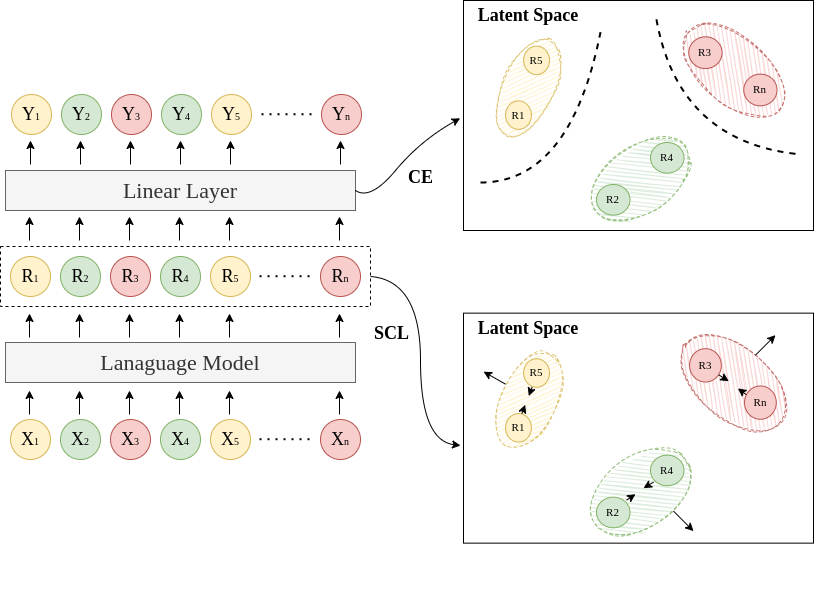

# Token-Level Supervised Contrastive Learning for Punctuation Restoration
## Overview
This project adapts **Supervised Contrastive Learning** to the punctuation restoration task. This is the implementation of the paper **Token-Level Supervised Contrastive Learning for Punctuation Restoration** accepted by [InterSpeech 2021](https://www.interspeech2021.org/)

## Data
The data has been converted by corresponding BERT tokenizer with labels, and save into the pickle files under the `dataset/` directory.

The original text files are from [**International Workshop on Spoken Language Translation, 2012**](http://hltc.cs.ust.hk/iwslt/index.php/evaluation-campaign/ted-task.html)

## Model Architecture
We fine-tune a Transformer-based language model with supervised contrastive learning for the punctuation restoration task.


## Environment Installation
To install the environment for this project, we recommend [Anaconda](https://www.anaconda.com/)

After having installed Anaconda, environment can be built by:
```bash
conda env create -f environment.yml
```

## Training
There are some example scripts under the `example_scripts` directory

Firstly, activate the anaconda environment by:
```bash
conda activate punc_interspeech
```

Then, execute the `train.py` by (Example):
```bash
python train.py --config=config/roberta-large-scl.yml -l 0.1 -t 0.6
```
Here, we provide several config files and example scripts in
- config/
- example_scripts/

During training, the log of the `tensorboard` will be located under `runs/` directory, which will be created automatically after program started.

Meanwhile, the models for each epoch will be saved under the `saved_model` directory.

## Evaluation
Evaluation can be done by running:
```
python evaluate.py --config=[config path] --checkpoint=[saved model file path]
```

## Cite this work
```

```